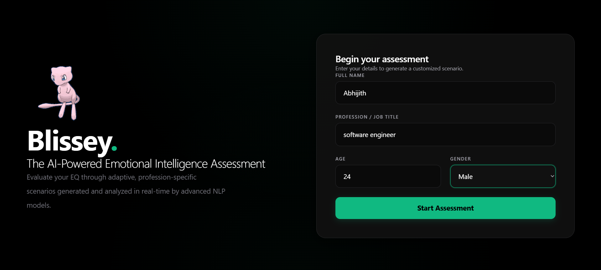
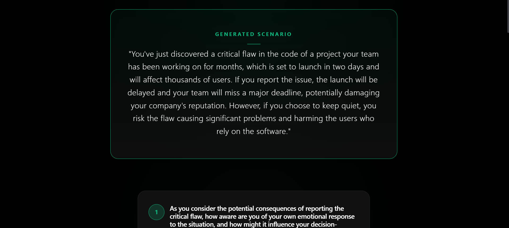
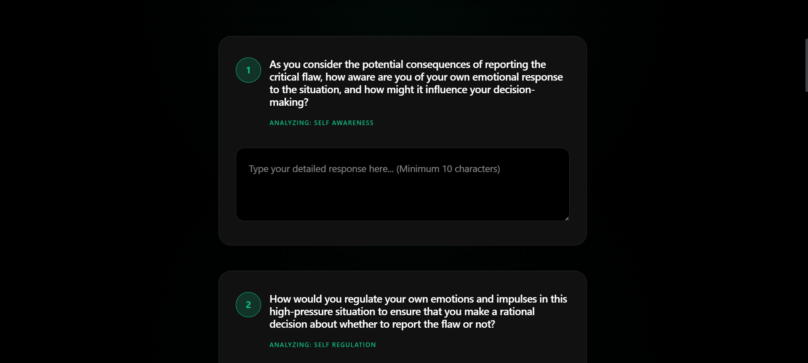
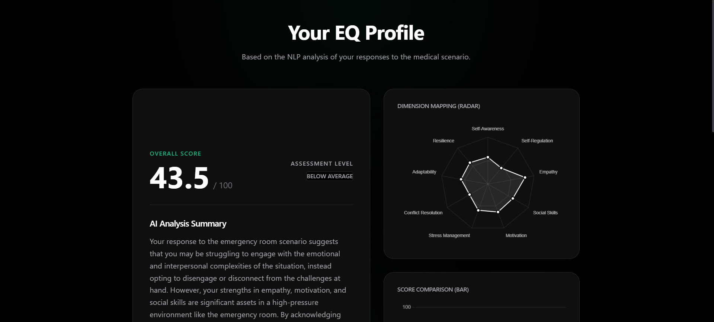
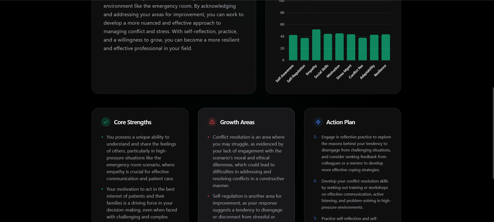

<div align="center">
  
  
  # Blissey: AI-Powered Emotional Intelligence Assessment
  
  **Live Demo:** [https://blissey-eq.netlify.app](https://blissey-eq.netlify.app)
</div>

---

Blissey is a modern, dynamic web application that evaluates a user's Emotional Intelligence (EQ) through highly personalized, profession-specific scenarios and advanced Natural Language Processing (NLP).

## 🌟 How It Works

1. **Personalization**: You enter your basic information (Name, Age, Profession).
2. **Dynamic AI Generation (Groq)**: The backend uses the lightning-fast **Groq API** (`llama-3.3-70b-versatile`) to generate a realistic, high-stress scenario specifically tailored to your exact age and profession.
3. **Adaptive Assessment**: The Groq LLM dynamically generates 9 questions based on your specific scenario, targeting 9 distinct EQ dimensions (e.g., Empathy, Resilience, Self-Regulation).
4. **NLP Analysis**: Your written answers are sent to the backend where two pre-trained HuggingFace Transformer models analyze the raw text:
   - **Emotion Model**: Detects core emotions (Joy, Anger, Fear, Sadness, etc.).
   - **Sentiment Model**: Evaluates if the tone is positive, negative, or neutral.
5. **Scoring Engine**: The system calculates a "Semantic Richness" score based on the length, depth, and vocabulary of your answer. This richness score acts as a multiplier against the NLP emotion scores to generate a final score out of 100 for each dimension.
6. **AI Psychological Report**: The system compiles your scores and answers, sending them back to the Groq LLM to generate a personalized, in-depth psychological feedback report highlighting your strengths and growth areas.
7. **Results & Visualization**: The app displays your overall EQ score and visualizes your dimensional profile using interactive Radar and Bar charts.
8. **PDF Export**: You can download a clean, professionally formatted PDF of your results generated via `reportlab`.

---

## 📸 Screenshots

| Landing Page | Scenario Loading |
| :---: | :---: |
|  |  |

| Adaptive Questions | AI Analysis & Feedback |
| :---: | :---: |
|  |  |

| Radar & Bar Charts |
| :---: |
|  |

---

## 🏗️ Architecture & File Structure

### Backend (Django REST Framework)
Located in `backend/`, the backend handles the heavy lifting of NLP analysis, LLM inference, and API endpoints.

**Core Files (`backend/eq_engine/`):**
- `constants.py`: Defines the 9 EQ dimensions and the specific HuggingFace model IDs used for NLP.
- `emotion_analyzer.py`: Initializes and runs the HuggingFace text-classification pipelines to extract raw emotion and sentiment scores.
- `eq_scoring.py`: Combines the NLP scores with a "Semantic Richness" calculator to produce the final 0-100 scores.
- `scenario_generator.py`: Uses the Groq API to dynamically generate a custom scenario.
- `question_generator.py`: Uses the Groq API to generate 9 scenario-specific questions.
- `feedback_generator.py`: Uses the Groq API to write a personalized psychological evaluation.

**API & Data (`backend/assessment/`):**
- `models.py`: Defines the SQLite database schemas.
- `views.py`: Exposes the REST API endpoints and handles the `reportlab` PDF generation.

### Frontend (React + Vite + TailwindCSS)
Located in `frontend/`, the frontend provides a sleek, dark-themed, premium glassmorphism UI with smooth Framer Motion animations.

**Core Pages (`frontend/src/pages/`):**
- `LandingPage.jsx`: The entrance. Collects user demographics.
- `AssessmentPage.jsx`: Displays the dynamic scenario and cycles through the 9 questions.
- `LoadingPage.jsx`: A stylized waiting screen featuring a spinning Mew animation that actually handles the backend API processing in real-time.
- `ResultsPage.jsx`: The final dashboard displaying the Overall Score, Radar Chart, Bar Chart, and textual feedback.

---

## 🚀 Tech Stack

**Frontend:**
- React (Vite)
- TailwindCSS (Styling & Layout)
- Framer Motion (Animations)
- Chart.js (Data Visualization)

**Backend:**
- Python / Django REST Framework
- Groq API (`llama-3.3-70b-versatile`)
- HuggingFace `transformers` (NLP Analysis)
- `reportlab` (PDF Generation)
- `gunicorn` & `whitenoise` (Production Deployment)

## ⚙️ Running Locally

1. **Backend:**
   ```bash
   cd backend
   pip install -r requirements.txt
   ```
   *Create a `.env` file in the root directory and add your `GROQ` API key.*
   ```bash
   python manage.py makemigrations
   python manage.py migrate
   python manage.py runserver
   ```

2. **Frontend:**
   ```bash
   cd frontend
   npm install
   npm run dev
   ```
